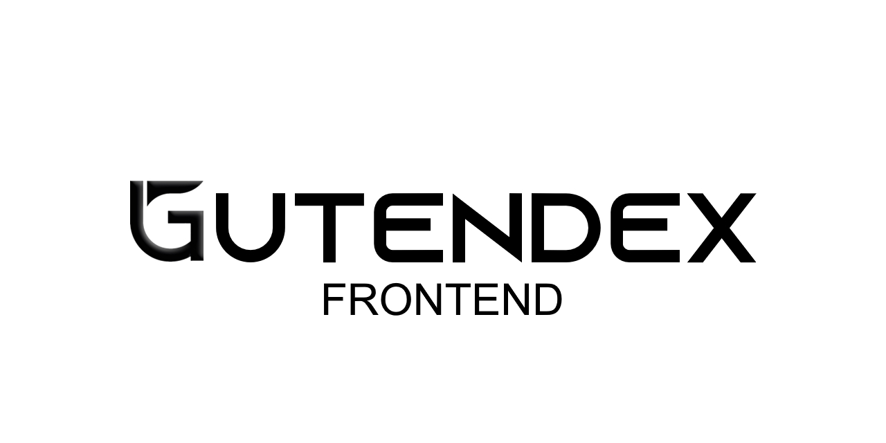

# Gutendex Frontend [](https://opensource.org/license/mit/)



## Introduction
Gutendex Frontend is a web application demonstrating the utilization of a REST API through to a frontend interface.

## Author
This code was developed by:
- Torgrim Thorsen [@SirAlexiner](https://github.com/SirAlexiner)

The project is hosted on [Render]()


## Features
- Visual demonstration of building upon and utilizing a REST API.
- Utilizes HTML templates, CSS, and minor JavaScript (JQuery).
- Python backend handles requests towards the API.

## Setup
To set up Gutendex Frontend locally, follow these steps:

1. Clone the repository:
   ```bash
   git clone https://github.com/SirAlexiner/gutendex.git
   ```

2. Navigate to the project directory:
   ```bash
   cd gutendex/Flask
   ```

3. Install dependencies using pip:
   ```bash
   pip install -r requirements.txt
   ```

4. Run the Flask server:
   ```bash
   python app.py
   ```

   Alternatively, for production deployment with Gunicorn:
   ```bash
   gunicorn app:app
   ```

5. Access the frontend web interface through your browser at `http://localhost:5000`.

## Roadmap
- Further work to the web interface will depend upon expansion of the Go Rest API.
- Possible new features to the web interface will require expansion of the GO Rest API.

## Contributing
Contributions to Gutendex Frontend are welcome! To contribute, follow these steps:

1. Fork the repository.
2. Clone your forked repository to your local machine.
3. Create a new branch for your changes.
4. Make your changes and commit them with clear and concise messages.
5. Push your changes to your forked repository.
6. Submit a pull request to the original repository, explaining your changes and their significance.

Please adhere to the project's code of conduct and more detailed contribution guidelines provided in the [`../readme/conduct.md`](../readme/conduct.md) and [`../readme/contribute.md`](../readme/contribute.md) files, respectively.

## License
This project is licensed under:
[](https://opensource.org/license/mit/)

You are free to download and use the code for academic or non-commercial purposes, but distribution, selling, or capitalizing on the project is strictly prohibited.
