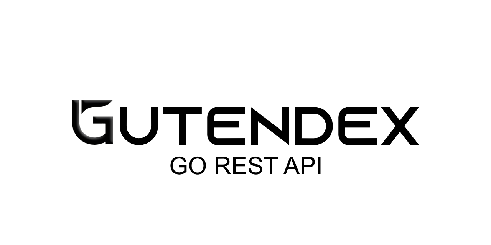

# Gutendex Go REST API [](https://opensource.org/license/mit/)



## Introduction
Gutendex Go REST API is a backend service designed to support Gutendex Frontend, a web application that demonstrates the utilization of a REST API through a frontend interface.

## Author
This code was developed by:
- Torgrim Thorsen [@SirAlexiner](https://github.com/SirAlexiner)

The project is hosted on [Render]()

## Features
- Provides endpoints for accessing data utilized by Gutendex Frontend.
- Built with Go, offering efficient and concurrent handling of HTTP requests.
- Designed to support the functionalities required by the Gutendex Frontend web application.

## Endpoints

### Library
- **Endpoint**: `/library/v1/?languages={:two_letter_language_code+}{&search={:string}}{&page={:number}}`
- **Method**: GET
- **Description**: This endpoint provides access to the Gutendex library, allowing users to retrieve various information about books and their metadata. Users can specify parameters to filter the results:
  - `languages`: Optional parameter to filter books by language. Users can specify one or more two-letter language codes.
  - `search`: Optional parameter to search for books based on a provided string.
  - `page`: Optional parameter to paginate through the results, specifying the page number.

Example:
```
/library/v1/?languages=en,fr&search=charles&page=1
```

This endpoint enables users to query the Gutendex library and retrieve relevant book information based on their criteria.

### Supported Languages
- **Endpoint**: `/librarystats/v1/supported_languages/`
- **Method**: GET
- **Description**: This endpoint returns a list of supported languages for the Gutendex library.

### Book Count
- **Endpoint**: `/librarystats/v1/bookcount/?languages={:two_letter_language_code+}/`
- **Method**: GET
- **Description**: This endpoint allows users to retrieve the count of books, authors, and pages available in the Gutendex library for the specified languages.
- **Parameters**:
  - `languages`: (Required) Specifies the languages for which book count is requested. It accepts one or more two-letter language codes.
- **Example**:
  ```
  /librarystats/v1/bookcount/?languages=en,fr
  ```

### Readership
- **Endpoint**: `/librarystats/v1/readership/{:two_letter_language_code}/{?limit={:number}}`
- **Description**: This endpoint retrieves statistics related to readership, such as the number of possible readers for the Gutendex library from countries for a specified language.
- **Parameters**:
  - `language_code`: (Required) Specifies the language for which readership statistics are requested.
  - `limit`: (Optional) Limits the number of results returned. Defaults to all readership statistics if not provided.
- **Example**:
  ```
  /librarystats/v1/readership/en/?limit=10
  ```

### Status
- **Endpoint**: `/librarystats/v1/status/`
- **Method**: GET
- **Description**: This endpoint returns the current status of the Gutendex library, providing information about the uptime, version number, and the status of the APIs Gutendex is communicating with. Users can utilize this endpoint to monitor the availability and operational status of the Gutendex service.

These endpoints enable users to interact with the Gutendex REST API, accessing various functionalities and retrieving relevant data.

## Setup
To Run Gutendex REST API locally, follow these steps:

1. Clone the repository:
   ```bash
   git clone https://github.com/yourusername/gutendex.git
   ```

2. Navigate to the project directory:
   ```bash
   cd Gutendex/Go/cmd/gutendex_api
   ```

3. Run the Go server:
   ```bash
   go run app.go
   ```

5. Access the REST API endpoints through your preferred HTTP client or integrate them with Gutendex Frontend.

## Roadmap
- Future development of the Gutendex REST API will align with the expansion of features and functionalities possible for the Gutendex Frontend.

## Contributing
Contributions to the Gutendex REST API are welcome! To contribute, follow these steps:

1. Fork the repository.
2. Clone your forked repository to your local machine.
3. Create a new branch for your changes.
4. Make your changes and commit them with clear and concise messages.
5. Push your changes to your forked repository.
6. Submit a pull request to the original repository, explaining your changes and their significance.

Please adhere to the project's code of conduct and contribution guidelines provided in the [`../readme/conduct.md`](../readme/conduct.md) and [`../readme/contribute.md`](../readme/contribute.md) files, respectively.

## License
This project is licensed under:
[](https://opensource.org/license/mit/)

You are free to download and use the code for academic or non-commercial purposes, but distribution, selling, or capitalizing on the project is strictly prohibited.