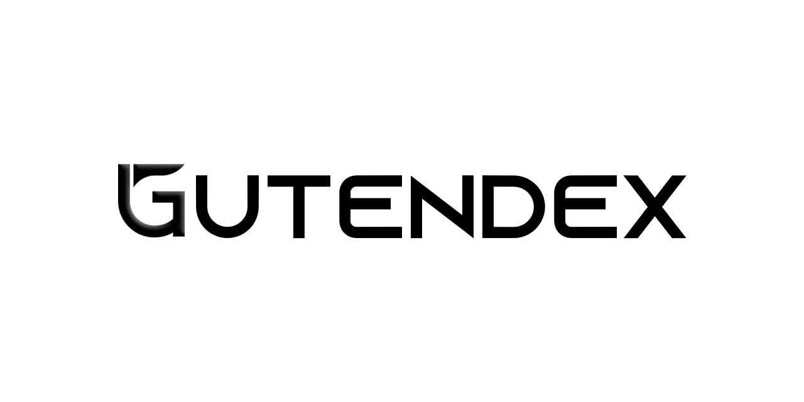

# Gutendex 

## Introduction
Gutendex is a repository containing both a Go REST API and a Python Flask Web Server.

## About Gutendex

Gutendex is a school project aimed at showcasing the integration of a REST API with a frontend web server. It provides functionalities for accessing and managing book data through the API and presenting it in a user-friendly manner via the web server.

## Components

- **Go REST API**: This component provides endpoints for interacting with the Gutendex library, retrieving books by language, readership statistics, and more.
- **Python Flask Web Server**: This component serves as the frontend interface for Gutendex, allowing users to access the functionalities provided by the REST API through a visual web interface.

## More Information

For detailed information about the Go REST API and Python Flask Web Server components, please refer to their respective README files in the repository.

- For information about the Go REST API, please see the README located here [`Go/readme.md`](Go/readme.md).
- For information about the Python Flask Web Server, please see the README located here: [`Flask/readme.md`](Flask/readme.md).

Feel free to explore the repository for more details and to get started with Gutendex!

## License
This project is licensed under:

You are free to download and use the code for academic or non-commercial purposes, but distribution, selling, or capitalizing on the project is strictly prohibited.